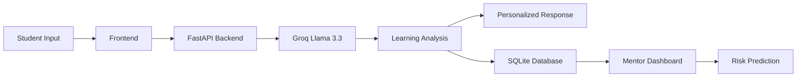

<div align="center">

# 🎓 Lumina AI
### AI-Powered Personalized Learning Assistant & Mentor Platform
*(formerly "Mentora AI")*


**Learn Smarter • Teach Better • Empower Every Student 🎓**

</div>

---

## 📖 Overview

**Lumina AI** is an Agentic AI-powered learning platform that delivers personalized education using AI while helping mentors identify struggling students through intelligent analytics.

Built using **FastAPI**, **Python**, **Groq Llama 3.3**, **SQLite**, **HTML**, **CSS**, and **JavaScript**, the platform offers AI tutoring, summaries, quizzes, flashcards, concept maps, voice quizzes, and mentor analytics — now hardened for containerized and cloud deployment.

### 🎯 Goal

Support **United Nations SDG 4 – Quality Education** by making intelligent, personalized education accessible to every learner.

---

## ✨ Features

- 🤖 AI Tutor (streaming responses)
- 📝 Smart Notes Summarizer
- ❓ Quiz Generator
- 🧠 Flashcards
- 🗺️ Concept Map Generator
- 🎙️ Voice Quiz
- 📖 ELI5 → Expert Learning Mode
- 🎓 Feynman Learning Checker
- 🚑 Exam Panic Mode
- 👨‍🏫 Mentor Dashboard
- 📊 Student Analytics
- 🚨 Dropout Risk Prediction with AI-generated nudges
- 📱 Responsive Interface

---

## 🏗️ Architecture



---

## 🛠️ Tech Stack

| Component | Technology |
|------------|------------|
| Frontend | HTML, CSS, JavaScript |
| Backend | FastAPI |
| AI Model | Groq Llama 3.3 (70B) |
| API | Groq API |
| Database | SQLite |
| Containerization | Docker / docker-compose |
| Deployment | AWS App Runner, AWS Elastic Beanstalk, or Render |
| Security | `python-dotenv`, environment-variable secrets |

---

## 🚀 Local Installation (without Docker)

### Clone Repository

```bash
git clone https://github.com/YOUR_USERNAME/lumina-ai.git
cd lumina-ai
```

### Install Dependencies

```bash
pip install -r requirements.txt
```

### Configure Environment

```bash
cp .env.example .env
# then edit .env and set GROQ_API_KEY=your_actual_key
```

### Run Application

```bash
uvicorn app:app --reload
```

Visit `http://localhost:8000`. A health check is available at `http://localhost:8000/health`.

---

## 🐳 Running with Docker

### Option A — plain Docker

```bash
docker build -t lumina-ai .
docker run -p 10000:10000 --env-file .env lumina-ai
```

### Option B — docker-compose (recommended for local dev)

```bash
cp .env.example .env   # fill in GROQ_API_KEY
docker-compose up --build
```

This mounts a named volume (`lumina_data`) so the SQLite mentor-dashboard database survives container restarts, and runs a health check against `/health` automatically.

Visit `http://localhost:10000`.

---

## ☁️ Deploying to AWS

Lumina AI ships with configuration for two AWS deployment paths. Pick whichever fits your workflow — both use the same Docker image / codebase.

### Option 1 — AWS App Runner (recommended, simplest)

App Runner can deploy either straight from source or from a container image.

**From a container image (ECR):**
1. Build and push the image:
   ```bash
   aws ecr create-repository --repository-name lumina-ai
   aws ecr get-login-password --region <region> | docker login --username AWS --password-stdin <account_id>.dkr.ecr.<region>.amazonaws.com
   docker build -t lumina-ai .
   docker tag lumina-ai:latest <account_id>.dkr.ecr.<region>.amazonaws.com/lumina-ai:latest
   docker push <account_id>.dkr.ecr.<region>.amazonaws.com/lumina-ai:latest
   ```
2. In the App Runner console: **Create service** → **Container registry** → select the ECR image.
3. Set port to `10000` (matches the Dockerfile `EXPOSE`).
4. Under **Environment variables**, add `GROQ_API_KEY` as a **secret** (App Runner supports AWS Secrets Manager references directly).
5. Health check path: `/health` (App Runner auto-detects this from the `HEALTHCHECK` in the Dockerfile, but you can also set it explicitly in the console).

**From source (no Docker/ECR needed):**
1. Push this repo to GitHub/CodeCommit.
2. In the App Runner console: **Create service** → **Source code repository** → connect the repo.
3. App Runner will read `apprunner.yaml` automatically (already included in this project) to build and run the app.
4. Add `GROQ_API_KEY` as an environment variable/secret in the console — **not** in `apprunner.yaml`, since that file is committed to source control.

### Option 2 — AWS Elastic Beanstalk

**Using the Docker platform (uses the included Dockerfile automatically):**
```bash
eb init -p docker lumina-ai --region <region>
eb create lumina-ai-env
eb setenv GROQ_API_KEY=your_actual_key ALLOWED_ORIGINS=*
```

**Using the Python platform instead (uses the included `Procfile`):**
```bash
eb init -p python-3.11 lumina-ai --region <region>
eb create lumina-ai-env
eb setenv GROQ_API_KEY=your_actual_key
```

Either way, EB's load balancer will use `/health` for its health check once configured in the environment's health check settings.

> ⚠️ Never commit real API keys. Both App Runner and Elastic Beanstalk let you set environment variables/secrets through the console or CLI — that's the only place `GROQ_API_KEY` should live outside your local `.env`.

---

## 📸 Screenshots

*(from the original build — UI is unchanged by this update)*

### Summarizer


### Mentor Dashboard


### AI Tutor


### Quiz Generator


### Flashcard


### Feynman Technique Checker


### Exam Panic Mode


### Concept Map


---

## 🌍 SDG 4 Impact

| SDG Target | Contribution |
|------------|--------------|
| SDG 4.1 | Personalized learning |
| SDG 4.4 | Digital education |
| SDG 4.5 | Inclusive education |
| SDG 4.7 | Lifelong learning |

### Expected Impact

- 📚 Better learning outcomes
- 🎯 Personalized education
- 👨‍🏫 Reduced teacher workload
- 🚨 Early intervention for struggling students
- 🌍 AI-powered quality education

---

## 🔮 Future Enhancements

- 📱 Android App
- 💬 WhatsApp AI Tutor
- 📄 PDF Chat
- 📷 OCR Notes Scanner
- ☁️ Managed cloud database (RDS/Aurora) for multi-instance deployments
- 🌐 Multi-language Support
- 📊 Institution Analytics
- 🎙️ Voice Assistant

---

## 📂 Project Structure

```text
lumina-ai/
│
├── app.py                  # FastAPI backend — all API routes + Mentor DB logic
├── requirements.txt        # Pinned Python dependencies
├── Dockerfile              # Production container image (non-root, healthcheck)
├── docker-compose.yml      # Local dev stack with persistent SQLite volume
├── .dockerignore
├── .gitignore
├── .env.example            # Template for local secrets — copy to .env
├── apprunner.yaml          # AWS App Runner source-deploy config
├── Procfile                # AWS Elastic Beanstalk (Python platform) fallback
├── README.md
├── PROJECT_REPORT.md        # Full project report
├── Concept Note.md
│
├── static/
│   ├── css/
│   │   └── style.css
│   ├── js/
│   │   ├── app.js
│   │   └── api.js           # Frontend ↔ backend API client (all fetch calls)
│   └── index.html
```

---

## 🔐 Security Notes

- `GROQ_API_KEY` is read only from environment variables (`os.environ`) — never hardcoded.
- `.env` is git-ignored and docker-ignored by default; only `.env.example` (a template with no real secrets) is committed.
- The Docker image runs the app as a non-root `appuser`.
- CORS is restricted via `ALLOWED_ORIGINS` (defaults to `*` for same-origin single-service deployments — tighten this if you split frontend/backend).

---

## 👨‍💻 Author

**Pritesh Patro**

**Generative AI & Agentic Systems Engineering Intern** at **Lenovo LEAP**

🔗 GitHub Repository: https://github.com/Pritesh-05/lumina-ai

🔗 LinkedIn: https://www.linkedin.com/in/pritesh-patro

🔗 Lenovo LEAP Capstone 5 Repository: https://github.com/Pritesh-05/University-Central-Student-Portal-with-Virtual-Assistant

🔗 Lenovo LEAP Capstone 8 Repository: https://github.com/Pritesh-05/careerguide-ai

This project was developed as part of the **Lenovo LEAP Internship Program 2026**, originally shipped as *Mentora AI* and since rebranded and hardened for production/cloud deployment as **Lumina AI**.

---

## 🙏 Acknowledgements

- Lenovo LEAP Internship Program
- Groq AI
- FastAPI
- AWS App Runner / Elastic Beanstalk
- SQLite
- United Nations SDG 4

---

<div align="center">

### 🎓 Learn Smarter. Teach Better. Empower Every Student.

Made with ❤️ for SDG 4: Quality Education

</div>
